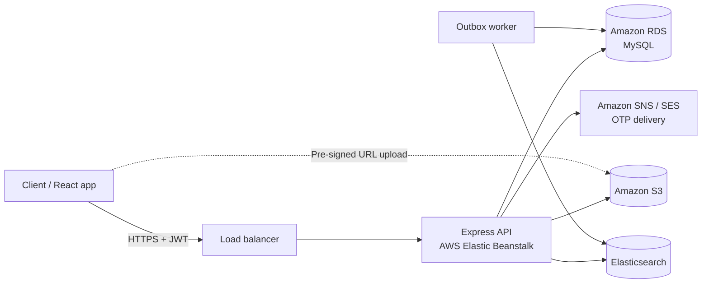
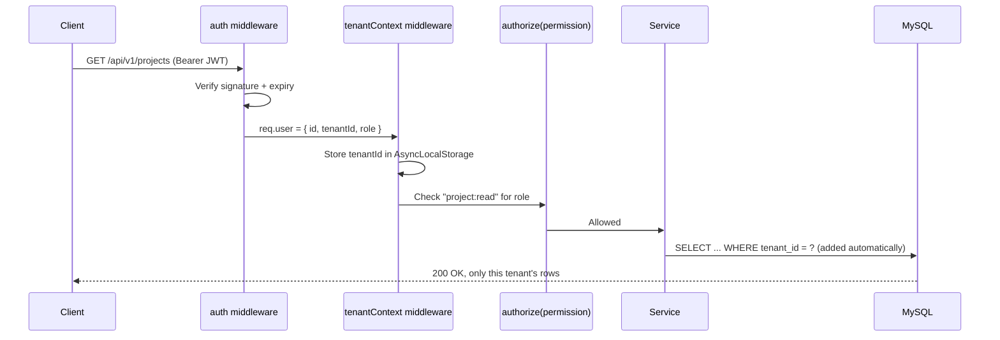
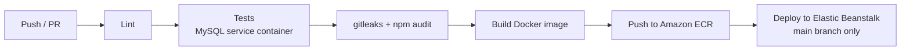

# Multi-Tenant SaaS API

Production-style multi-tenant SaaS backend built with **Node.js, Express, Sequelize and MySQL**. Each organization (tenant) gets fully isolated data, role-based access, OTP-verified login, secure file uploads to Amazon S3, and full-text search through Elasticsearch, all shipped through a CI/CD pipeline to **AWS Elastic Beanstalk**.


**Live demo:** `<demo-url>` · **API docs (Swagger):** `<demo-url>/docs`

---

## Table of contents

1. [What this project demonstrates](#what-this-project-demonstrates)
2. [Architecture](#architecture)
3. [Multi-tenancy model](#multi-tenancy-model)
4. [Features](#features)
5. [Tech stack](#tech-stack)
6. [API overview](#api-overview)
7. [Project structure](#project-structure)
8. [Run locally](#run-locally)
9. [Environment variables](#environment-variables)
10. [Testing](#testing)
11. [CI/CD and deployment](#cicd-and-deployment)
12. [Security](#security)
13. [Design decisions](#design-decisions)
14. [Roadmap](#roadmap)
15. [License](#license)

---

## What this project demonstrates

| Area | Implementation |
|---|---|
| Multi-tenant SaaS architecture | Shared database with `tenant_id` isolation enforced in middleware and the data layer |
| Authentication | Email + password, OTP verification (email/SMS), JWT access tokens with rotating refresh tokens |
| Authorization | Role-based access control (Owner, Admin, Member, Viewer) with a central permission map |
| Cloud storage | Direct-to-S3 uploads and downloads via pre-signed URLs, tenant-prefixed object keys |
| Search | Elasticsearch index kept in sync through a transactional outbox |
| API quality | Versioned REST API, Joi validation, consistent error format, cursor pagination, Swagger/OpenAPI docs |
| Delivery | Docker, Jest + Supertest tests, GitHub Actions (and Jenkinsfile) deploying to AWS Elastic Beanstalk |

The domain is intentionally simple (organizations, users, projects, tasks, files) so the focus stays on the architecture.

---

## Architecture



### Request lifecycle



---

## Multi-tenancy model

**Model:** shared database, shared schema, `tenant_id` column on every tenant-owned table.

How isolation is enforced, in three layers:

1. **Request layer.** `tenantContext` middleware reads the tenant from the verified JWT (never from the request body or query string) and stores it in `AsyncLocalStorage`.
2. **Data layer.** Sequelize hooks add `tenant_id` to every create and a `WHERE tenant_id = ?` filter to every find, update and delete on tenant-owned models. A query run without a tenant context throws instead of returning all tenants' data.
3. **Database layer.** Composite indexes start with `tenant_id`, and unique constraints include it (for example, `UNIQUE (tenant_id, email)`), so data from different tenants can never collide.

Cross-tenant access returns **404 Not Found**, not 403, so the API never confirms that another tenant's record exists.

---

## Features

### Organizations and users
- Self-service organization sign-up that creates the tenant and its Owner account in one transaction
- Invite users by email with a role; invitation tokens expire after 72 hours
- Change roles and deactivate users (an organization must always keep at least one Owner)

### Authentication
- Password hashing with bcrypt
- OTP verification over email or SMS through a provider interface (mock in development, Amazon SES / SNS in production)
- Short-lived JWT access tokens (15 minutes) and refresh tokens (7 days)
- Refresh token rotation with reuse detection: a reused refresh token revokes that whole session family
- Logout revokes the current refresh token

### Authorization (RBAC)

| Permission | Owner | Admin | Member | Viewer |
|---|:-:|:-:|:-:|:-:|
| Manage organization settings | ✓ | | | |
| Invite users / change roles | ✓ | ✓ | | |
| Create / edit projects | ✓ | ✓ | ✓ | |
| Create / edit tasks | ✓ | ✓ | ✓ | |
| Read projects and tasks | ✓ | ✓ | ✓ | ✓ |

Permissions live in one map (`src/config/permissions.js`) and are checked with `authorize('task:update')` middleware on each route.

### Projects and tasks
- CRUD for projects and tasks, with status, priority, assignee and due date
- Cursor-based pagination for stable paging on large lists
- Soft deletes (`paranoid` models) with an audit trail

### Files
- `POST /files/presign-upload` returns a pre-signed S3 PUT URL; the client uploads directly to S3
- Object keys are prefixed `tenants/<tenantId>/...`, so a key can never point into another tenant's files
- File type and size are validated before a URL is issued; download URLs expire after 5 minutes

### Search
- Full-text search over task titles and descriptions through Elasticsearch
- Every search query carries a mandatory `tenant_id` filter
- Writes go to an `outbox_events` table in the same transaction as the data change; a worker pushes them to Elasticsearch, so the index stays consistent even if Elasticsearch is temporarily down

### Operations
- Structured JSON logging (pino) with a request ID on every log line
- `GET /health/live` and `GET /health/ready` (checks MySQL and Elasticsearch connectivity)
- Graceful shutdown that finishes in-flight requests before the process exits

---

## Tech stack

| Layer | Technology |
|---|---|
| Runtime | Node.js 20, Express.js |
| Database | MySQL 8, Sequelize ORM (migrations and seeders) |
| Search | Elasticsearch 8 |
| Auth | JWT, bcrypt, OTP |
| Validation | Joi |
| Cloud | AWS Elastic Beanstalk, Amazon RDS, Amazon S3, Amazon SNS / SES, Amazon ECR |
| Testing | Jest, Supertest |
| API docs | Swagger / OpenAPI 3 |
| DevOps | Docker, Docker Compose, GitHub Actions, Jenkins, LocalStack (local S3) |
| Quality | ESLint (with `eslint-plugin-security`), Prettier, gitleaks, npm audit |

---

## API overview

Base path: `/api/v1`. Full interactive documentation is served at `/docs`.

| Method | Endpoint | Description | Permission |
|---|---|---|---|
| POST | `/auth/register-organization` | Create a tenant and its Owner | Public |
| POST | `/auth/login` | Email + password login | Public |
| POST | `/auth/otp/request` | Send OTP by email or SMS | Public |
| POST | `/auth/otp/verify` | Verify OTP, issue tokens | Public |
| POST | `/auth/refresh` | Rotate refresh token | Public (refresh token) |
| POST | `/auth/logout` | Revoke refresh token | Authenticated |
| GET | `/users` | List users in the organization | `user:read` |
| POST | `/users/invite` | Invite a user with a role | `user:invite` |
| PATCH | `/users/:id/role` | Change a user's role | `user:manage` |
| GET | `/projects` | List projects (cursor pagination) | `project:read` |
| POST | `/projects` | Create a project | `project:write` |
| PATCH | `/projects/:id` | Update a project | `project:write` |
| DELETE | `/projects/:id` | Soft-delete a project | `project:write` |
| GET | `/projects/:id/tasks` | List tasks in a project | `task:read` |
| POST | `/projects/:id/tasks` | Create a task | `task:write` |
| PATCH | `/tasks/:id` | Update a task | `task:write` |
| GET | `/tasks/search?q=` | Full-text task search | `task:read` |
| POST | `/files/presign-upload` | Get a pre-signed S3 upload URL | `file:write` |
| GET | `/files/:id/download-url` | Get a pre-signed S3 download URL | `file:read` |

### Error format

Every error uses the same shape:

```json
{
  "error": {
    "code": "VALIDATION_ERROR",
    "message": "title is required",
    "requestId": "a1b2c3d4"
  }
}
```

---

## Project structure

```
multi-tenant-saas-api/
├── src/
│   ├── app.js                  # Express app setup (middleware, routes, error handler)
│   ├── server.js               # HTTP server + graceful shutdown
│   ├── config/
│   │   ├── index.js            # Environment config, validated at startup
│   │   └── permissions.js      # RBAC permission map
│   ├── middleware/
│   │   ├── authenticate.js     # JWT verification
│   │   ├── tenantContext.js    # AsyncLocalStorage tenant scope
│   │   ├── authorize.js        # Permission checks
│   │   ├── validate.js         # Joi request validation
│   │   ├── rateLimit.js
│   │   └── errorHandler.js
│   ├── modules/
│   │   ├── auth/               # routes, controller, service, schemas
│   │   ├── users/
│   │   ├── projects/
│   │   ├── tasks/
│   │   ├── files/
│   │   └── search/
│   ├── db/
│   │   ├── models/
│   │   ├── migrations/
│   │   ├── seeders/
│   │   └── tenantScope.js      # Sequelize hooks enforcing tenant_id
│   ├── providers/              # S3, OTP (SES/SNS/mock), Elasticsearch clients
│   ├── jobs/
│   │   └── outboxWorker.js     # Syncs outbox events to Elasticsearch
│   └── utils/
├── tests/
│   ├── unit/
│   └── integration/
├── docs/
│   └── architecture.md
├── .github/workflows/
│   ├── ci.yml
│   └── deploy.yml
├── Jenkinsfile
├── Dockerfile
├── docker-compose.yml
├── .env.example
└── README.md
```

Each module follows the same layering: **routes → controller → service → repository**. Controllers handle HTTP only, services hold business rules, and repositories are the only code that touches Sequelize.

---

## Run locally

**Prerequisites:** Docker and Docker Compose, Node.js 20 (only for running tests outside Docker).

```bash
git clone https://github.com/shantanuban96/multi-tenant-saas-api.git
cd multi-tenant-saas-api
cp .env.example .env

docker compose up -d          # API, MySQL, Elasticsearch, LocalStack (S3)
docker compose exec api npm run db:migrate
docker compose exec api npm run db:seed   # two demo tenants with sample data
```

- API: `http://localhost:3000/api/v1`
- Swagger docs: `http://localhost:3000/docs`
- Seeded logins: see `src/db/seeders/README.md` (two tenants, one user per role)

### npm scripts

| Script | Purpose |
|---|---|
| `npm run dev` | Start with hot reload |
| `npm test` | Unit + integration tests |
| `npm run test:coverage` | Tests with coverage report |
| `npm run lint` | ESLint + Prettier check |
| `npm run db:migrate` | Run Sequelize migrations |
| `npm run db:seed` | Seed demo data |
| `npm run worker` | Start the outbox worker |

---

## Environment variables

| Variable | Description | Example |
|---|---|---|
| `NODE_ENV` | Runtime environment | `development` |
| `PORT` | HTTP port | `3000` |
| `DB_HOST` / `DB_PORT` / `DB_NAME` / `DB_USER` / `DB_PASSWORD` | MySQL connection | `mysql` / `3306` / `saas` / `app` / `secret` |
| `JWT_ACCESS_SECRET` | Access token signing secret | 64+ random characters |
| `JWT_REFRESH_SECRET` | Refresh token signing secret | 64+ random characters |
| `JWT_ACCESS_TTL` / `JWT_REFRESH_TTL` | Token lifetimes | `15m` / `7d` |
| `AWS_REGION` | AWS region | `ap-south-1` |
| `S3_BUCKET` | Bucket for uploads | `saas-api-files` |
| `S3_ENDPOINT` | Override for LocalStack (local only) | `http://localstack:4566` |
| `OTP_PROVIDER` | `mock`, `ses` or `sns` | `mock` |
| `ELASTICSEARCH_URL` | Elasticsearch node | `http://elasticsearch:9200` |
| `CORS_ORIGINS` | Comma-separated allowed origins | `http://localhost:5173` |

Configuration is validated with Joi at startup; the process exits with a clear message if a required variable is missing.

---

## Testing

```bash
npm test
npm run test:coverage
```

- **Unit tests:** services, permission checks, token rotation logic
- **Integration tests:** Supertest against a real MySQL container, covering full request flows
- **Tenant-isolation tests:** for every tenant-owned resource, a user from tenant A reads, updates and deletes tenant B's records and must receive `404`
- **Auth tests:** expired tokens, reused refresh tokens, wrong role on protected routes

---

## CI/CD and deployment

### Pipeline (GitHub Actions)



- Pull requests run lint, tests and security scans; merging is blocked if any step fails
- Merges to `main` build the image, push it to Amazon ECR and deploy a new Elastic Beanstalk application version
- Migrations run as a pre-deploy step; a failed health check rolls the environment back to the previous version
- A `Jenkinsfile` with the same stages is included for teams that use Jenkins

### AWS deployment

| Component | Service |
|---|---|
| API | AWS Elastic Beanstalk (Docker platform) behind an Application Load Balancer |
| Database | Amazon RDS for MySQL |
| Files | Amazon S3 (private bucket, pre-signed URLs only) |
| OTP delivery | Amazon SES (email), Amazon SNS (SMS) |
| Images | Amazon ECR |
| Secrets | Elastic Beanstalk environment properties, never committed |

---

## Security

- Tenant ID is taken only from the verified JWT, never from client input
- Every query is tenant-scoped at the data layer; unscoped queries throw
- Ownership and tenant checks prevent IDOR (insecure direct object reference) attacks
- Joi validation on every request body, query and route parameter
- Parameterized queries through Sequelize; no raw SQL built from user input
- `helmet` security headers, strict CORS allowlist, rate limiting on auth routes
- bcrypt password hashing; OTPs are hashed, single-use and expire after 5 minutes
- Refresh token rotation with reuse detection
- S3 bucket blocks all public access; files are reachable only through short-lived pre-signed URLs
- `eslint-plugin-security`, gitleaks and npm audit run in CI

---

## Design decisions

**Shared schema instead of a database per tenant.**
Cheapest to run and simplest to migrate (one migration covers every tenant). The trade-off is that isolation depends on code, which is why it is enforced in three layers and covered by dedicated tests. Database-per-tenant would make sense for tenants with strict compliance requirements.

**Tenant context in AsyncLocalStorage.**
Passing `tenantId` through every function call is easy to forget. Storing it per request means the data layer can apply the filter automatically, and a missing context fails loudly instead of leaking data.

**404 instead of 403 for other tenants' records.**
A 403 confirms that the record exists. A 404 reveals nothing.

**Pre-signed URLs instead of proxying files through the API.**
Uploads and downloads go straight between the client and S3, so large files never consume API memory or bandwidth, and the bucket stays private.

**Transactional outbox for search indexing.**
Writing to MySQL and Elasticsearch separately can leave them out of sync if one call fails. Writing an outbox event in the same database transaction guarantees that every committed change eventually reaches the index.

**UUIDs for public IDs.**
Sequential IDs let anyone guess how many records exist and probe neighbouring IDs. UUIDs remove both problems.

---

## Roadmap

- [ ] Redis caching for hot read paths
- [ ] Per-tenant rate limits and usage quotas
- [ ] Outgoing webhooks with signed payloads and retries
- [ ] OpenTelemetry tracing
- [ ] React admin dashboard (TypeScript + Vite)

---

## License

MIT © Shantanu Banerjee

**Author:** Shantanu Banerjee, Senior Software Engineer · [LinkedIn](https://www.linkedin.com/in/shantanu-banerjee-06027431a)
