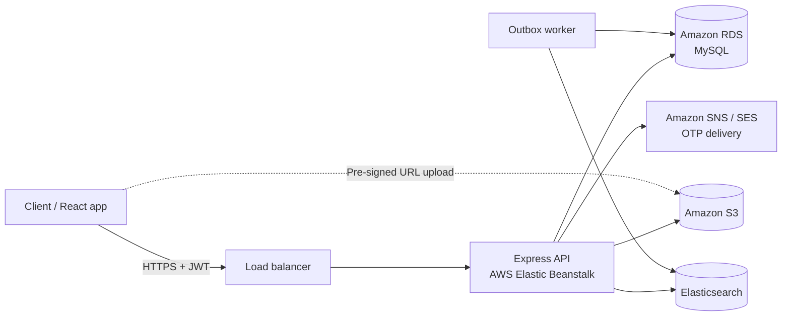
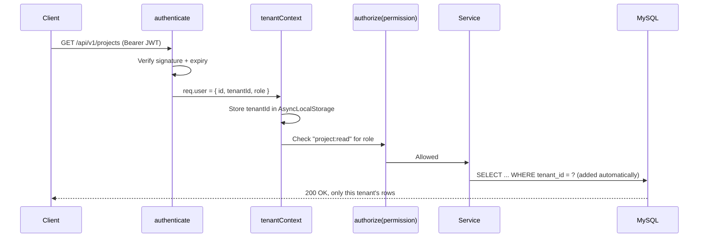
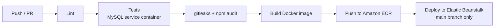

<a id="readme-top"></a>

<div align="center">


<p>
Production-style multi-tenant SaaS backend built with <b>Node.js, Express, Sequelize and MySQL</b>.<br/>
Every organization gets fully isolated data, role-based access, OTP-verified login, secure S3 uploads<br/>
and full-text search, shipped through a CI/CD pipeline to <b>AWS Elastic Beanstalk</b>.
</p>

<!-- After .github/workflows/ci.yml exists, replace the Status badge with:
 -->


<p>


</p>

<b>
<a href="#-overview">Overview</a> •
<a href="#-architecture">Architecture</a> •
<a href="#-features">Features</a> •
<a href="#-api-reference">API</a> •
<a href="#-quick-start">Quick start</a> •
<a href="#-cicd-and-deployment">CI/CD</a> •
<a href="#-design-decisions">Design decisions</a>
</b>

<br/><br/>

**Live demo:** `<demo-url>` &nbsp;|&nbsp; **API docs:** `<demo-url>/docs`

</div>

---

## 🧭 Overview

> [!NOTE]
> The domain (organizations, users, projects, tasks, files) is intentionally simple so the focus stays on the architecture: tenant isolation, security, search consistency and delivery.

| Area | What it demonstrates |
|---|---|
| 🏢 **Multi-tenant SaaS** | Shared database with `tenant_id` isolation enforced in middleware **and** the data layer |
| 🔐 **Authentication** | Email + password, OTP verification (email/SMS), JWT access tokens with rotating refresh tokens |
| 🛡️ **Authorization** | Role-based access control (Owner, Admin, Member, Viewer) driven by one permission map |
| ☁️ **Cloud storage** | Direct-to-S3 uploads and downloads through pre-signed URLs, tenant-prefixed object keys |
| 🔎 **Search** | Elasticsearch index kept in sync through a transactional outbox |
| 📐 **API quality** | Versioned REST API, Joi validation, consistent errors, cursor pagination, Swagger/OpenAPI |
| 🚀 **Delivery** | Docker, Jest + Supertest, GitHub Actions and Jenkinsfile deploying to AWS Elastic Beanstalk |

### Build progress

| Module | Status |
|---|:-:|
| Project skeleton, Docker Compose, config validation | 🚧 |
| Tenant context + data-layer isolation | 🚧 |
| Auth: password, OTP, JWT + refresh rotation | 🚧 |
| RBAC permission map + `authorize()` middleware | 🚧 |
| Projects and tasks (CRUD, cursor pagination) | 🚧 |
| Files: S3 pre-signed upload / download | 🚧 |
| Search: Elasticsearch + outbox worker | 🚧 |
| Tests: unit, integration, tenant-isolation suite | 🚧 |
| CI/CD: GitHub Actions + Jenkinsfile → Elastic Beanstalk | 🚧 |

<sub>✅ done · 🚧 in progress / planned</sub>

<p align="right">(<a href="#readme-top">back to top</a>)</p>

---

## 🧩 Architecture



<details>
<summary><b>🔁 Request lifecycle (click to expand)</b></summary>
<br/>



</details>

<details>
<summary><b>🧱 Multi-tenancy model: three layers of isolation (click to expand)</b></summary>
<br/>

**Model:** shared database, shared schema, `tenant_id` on every tenant-owned table.

| Layer | How isolation is enforced |
|---|---|
| **1. Request** | `tenantContext` middleware reads the tenant from the verified JWT (never from body or query) and stores it in `AsyncLocalStorage` |
| **2. Data** | Sequelize hooks add `tenant_id` to every create and a `WHERE tenant_id = ?` filter to every find, update and delete. A query without tenant context **throws** instead of returning all tenants' data |
| **3. Database** | Composite indexes start with `tenant_id`; unique constraints include it, e.g. `UNIQUE (tenant_id, email)` |

> [!IMPORTANT]
> Cross-tenant access returns **404 Not Found**, not 403, so the API never confirms that another tenant's record exists.

</details>

<p align="right">(<a href="#readme-top">back to top</a>)</p>

---

## ✨ Features

<details open>
<summary><b>🏢 Organizations and users</b></summary>
<br/>

- Self-service organization sign-up that creates the tenant and its Owner in one transaction
- Invite users by email with a role; invitation tokens expire after 72 hours
- Change roles and deactivate users (an organization always keeps at least one Owner)

</details>

<details>
<summary><b>🔐 Authentication</b></summary>
<br/>

- Password hashing with bcrypt
- OTP over email or SMS through a provider interface (mock in development, Amazon SES / SNS in production)
- Short-lived JWT access tokens (15 min) and refresh tokens (7 days)
- Refresh token rotation with reuse detection: a reused token revokes the whole session family
- Logout revokes the current refresh token

</details>

<details>
<summary><b>🛡️ Authorization (RBAC)</b></summary>
<br/>

| Permission | Owner | Admin | Member | Viewer |
|---|:-:|:-:|:-:|:-:|
| Manage organization settings | ✅ | | | |
| Invite users / change roles | ✅ | ✅ | | |
| Create / edit projects | ✅ | ✅ | ✅ | |
| Create / edit tasks | ✅ | ✅ | ✅ | |
| Read projects and tasks | ✅ | ✅ | ✅ | ✅ |

Permissions live in one map (`src/config/permissions.js`) and are enforced with `authorize('task:update')` on each route.

</details>

<details>
<summary><b>📋 Projects and tasks</b></summary>
<br/>

- CRUD for projects and tasks with status, priority, assignee and due date
- Cursor-based pagination for stable paging on large lists
- Soft deletes (`paranoid` models) with an audit trail

</details>

<details>
<summary><b>☁️ Files (Amazon S3)</b></summary>
<br/>

- `POST /files/presign-upload` returns a pre-signed PUT URL; the client uploads directly to S3
- Object keys are prefixed `tenants/<tenantId>/...`, so a key can never point into another tenant's files
- File type and size validated before a URL is issued; download URLs expire after 5 minutes

</details>

<details>
<summary><b>🔎 Search (Elasticsearch)</b></summary>
<br/>

- Full-text search over task titles and descriptions
- Every search query carries a mandatory `tenant_id` filter
- Writes go to an `outbox_events` table in the same transaction as the data change; a worker pushes them to Elasticsearch, so the index stays consistent even if Elasticsearch is briefly down

</details>

<details>
<summary><b>📈 Operations</b></summary>
<br/>

- Structured JSON logging (pino) with a request ID on every line
- `GET /health/live` and `GET /health/ready` (checks MySQL and Elasticsearch)
- Graceful shutdown that finishes in-flight requests before exiting

</details>

<p align="right">(<a href="#readme-top">back to top</a>)</p>

---

## 🧰 Tech stack

| Layer | Technology |
|---|---|
| Runtime | Node.js 20, Express.js |
| Database | MySQL 8, Sequelize ORM (migrations and seeders) |
| Search | Elasticsearch 8 |
| Auth | JWT, bcrypt, OTP |
| Validation | Joi |
| Cloud | AWS Elastic Beanstalk, Amazon RDS, Amazon S3, Amazon SNS / SES, Amazon ECR |
| Testing | Jest, Supertest |
| API docs | Swagger / OpenAPI 3 |
| DevOps | Docker, Docker Compose, GitHub Actions, Jenkins, LocalStack (local S3) |
| Quality | ESLint (`eslint-plugin-security`), Prettier, gitleaks, npm audit |

---

## 📡 API reference

Base path: `/api/v1` · Interactive docs at `/docs`

<details open>
<summary><b>🔐 Auth</b></summary>
<br/>

| Method | Endpoint | Description | Access |
|---|---|---|---|
| `POST` | `/auth/register-organization` | Create a tenant and its Owner | Public |
| `POST` | `/auth/login` | Email + password login | Public |
| `POST` | `/auth/otp/request` | Send OTP by email or SMS | Public |
| `POST` | `/auth/otp/verify` | Verify OTP, issue tokens | Public |
| `POST` | `/auth/refresh` | Rotate refresh token | Refresh token |
| `POST` | `/auth/logout` | Revoke refresh token | Authenticated |

</details>

<details>
<summary><b>👥 Users</b></summary>
<br/>

| Method | Endpoint | Description | Permission |
|---|---|---|---|
| `GET` | `/users` | List users in the organization | `user:read` |
| `POST` | `/users/invite` | Invite a user with a role | `user:invite` |
| `PATCH` | `/users/:id/role` | Change a user's role | `user:manage` |

</details>

<details>
<summary><b>📋 Projects and tasks</b></summary>
<br/>

| Method | Endpoint | Description | Permission |
|---|---|---|---|
| `GET` | `/projects` | List projects (cursor pagination) | `project:read` |
| `POST` | `/projects` | Create a project | `project:write` |
| `PATCH` | `/projects/:id` | Update a project | `project:write` |
| `DELETE` | `/projects/:id` | Soft-delete a project | `project:write` |
| `GET` | `/projects/:id/tasks` | List tasks in a project | `task:read` |
| `POST` | `/projects/:id/tasks` | Create a task | `task:write` |
| `PATCH` | `/tasks/:id` | Update a task | `task:write` |
| `GET` | `/tasks/search?q=` | Full-text task search | `task:read` |

</details>

<details>
<summary><b>☁️ Files</b></summary>
<br/>

| Method | Endpoint | Description | Permission |
|---|---|---|---|
| `POST` | `/files/presign-upload` | Get a pre-signed S3 upload URL | `file:write` |
| `GET` | `/files/:id/download-url` | Get a pre-signed S3 download URL | `file:read` |

</details>

<details>
<summary><b>⚠️ Error format</b></summary>
<br/>

Every error uses the same shape:

```json
{
  "error": {
    "code": "VALIDATION_ERROR",
    "message": "title is required",
    "requestId": "a1b2c3d4"
  }
}
```

</details>

<p align="right">(<a href="#readme-top">back to top</a>)</p>

---

## 🚀 Quick start

> [!TIP]
> Everything runs in Docker: API, MySQL, Elasticsearch and LocalStack (local S3). No AWS account is needed to run it locally.

```bash
git clone https://github.com/shantanuban96/multi-tenant-saas-api.git
cd multi-tenant-saas-api
cp .env.example .env

docker compose up -d
docker compose exec api npm run db:migrate
docker compose exec api npm run db:seed   # two demo tenants with sample data
```

| Service | URL |
|---|---|
| API | `http://localhost:3000/api/v1` |
| Swagger docs | `http://localhost:3000/docs` |
| Seeded logins | `src/db/seeders/README.md` (two tenants, one user per role) |

<details>
<summary><b>📜 npm scripts</b></summary>
<br/>

| Script | Purpose |
|---|---|
| `npm run dev` | Start with hot reload |
| `npm test` | Unit + integration tests |
| `npm run test:coverage` | Tests with coverage report |
| `npm run lint` | ESLint + Prettier check |
| `npm run db:migrate` | Run Sequelize migrations |
| `npm run db:seed` | Seed demo data |
| `npm run worker` | Start the outbox worker |

</details>

<details>
<summary><b>⚙️ Environment variables</b></summary>
<br/>

| Variable | Description | Example |
|---|---|---|
| `NODE_ENV` | Runtime environment | `development` |
| `PORT` | HTTP port | `3000` |
| `DB_HOST` / `DB_PORT` / `DB_NAME` / `DB_USER` / `DB_PASSWORD` | MySQL connection | `mysql` / `3306` / `saas` / `app` / `secret` |
| `JWT_ACCESS_SECRET` | Access token signing secret | 64+ random characters |
| `JWT_REFRESH_SECRET` | Refresh token signing secret | 64+ random characters |
| `JWT_ACCESS_TTL` / `JWT_REFRESH_TTL` | Token lifetimes | `15m` / `7d` |
| `AWS_REGION` | AWS region | `ap-south-1` |
| `S3_BUCKET` | Bucket for uploads | `saas-api-files` |
| `S3_ENDPOINT` | LocalStack override (local only) | `http://localstack:4566` |
| `OTP_PROVIDER` | `mock`, `ses` or `sns` | `mock` |
| `ELASTICSEARCH_URL` | Elasticsearch node | `http://elasticsearch:9200` |
| `CORS_ORIGINS` | Comma-separated allowed origins | `http://localhost:5173` |

Configuration is validated with Joi at startup; the process exits with a clear message if a required variable is missing.

</details>

<details>
<summary><b>🗂️ Project structure</b></summary>
<br/>

```
multi-tenant-saas-api/
├── src/
│   ├── app.js                  # Express app (middleware, routes, error handler)
│   ├── server.js               # HTTP server + graceful shutdown
│   ├── config/
│   │   ├── index.js            # Environment config, validated at startup
│   │   └── permissions.js      # RBAC permission map
│   ├── middleware/
│   │   ├── authenticate.js     # JWT verification
│   │   ├── tenantContext.js    # AsyncLocalStorage tenant scope
│   │   ├── authorize.js        # Permission checks
│   │   ├── validate.js         # Joi request validation
│   │   ├── rateLimit.js
│   │   └── errorHandler.js
│   ├── modules/                # auth, users, projects, tasks, files, search
│   ├── db/
│   │   ├── models/
│   │   ├── migrations/
│   │   ├── seeders/
│   │   └── tenantScope.js      # Sequelize hooks enforcing tenant_id
│   ├── providers/              # S3, OTP (SES/SNS/mock), Elasticsearch clients
│   ├── jobs/outboxWorker.js    # Syncs outbox events to Elasticsearch
│   └── utils/
├── tests/{unit,integration}/
├── docs/architecture.md
├── .github/workflows/{ci.yml,deploy.yml}
├── Jenkinsfile
├── Dockerfile
├── docker-compose.yml
└── .env.example
```

Each module follows **routes → controller → service → repository**. Controllers handle HTTP only, services hold business rules, and repositories are the only code that touches Sequelize.

</details>

<p align="right">(<a href="#readme-top">back to top</a>)</p>

---

## 🧪 Testing

```bash
npm test
npm run test:coverage
```

| Suite | Covers |
|---|---|
| **Unit** | Services, permission checks, token rotation logic |
| **Integration** | Supertest against a real MySQL container, full request flows |
| **Tenant isolation** | A user from tenant A reads, updates and deletes tenant B's records and must get `404`, for every tenant-owned resource |
| **Auth** | Expired tokens, reused refresh tokens, wrong role on protected routes |

---

## 🔄 CI/CD and deployment



- Pull requests run lint, tests and security scans; merging is blocked if any step fails
- Merges to `main` build the image, push it to Amazon ECR and deploy a new Elastic Beanstalk application version
- Migrations run as a pre-deploy step; a failed health check rolls back to the previous version
- A `Jenkinsfile` with the same stages is included for teams that use Jenkins

<details>
<summary><b>☁️ AWS deployment map</b></summary>
<br/>

| Component | Service |
|---|---|
| API | AWS Elastic Beanstalk (Docker platform) behind an Application Load Balancer |
| Database | Amazon RDS for MySQL |
| Files | Amazon S3 (private bucket, pre-signed URLs only) |
| OTP delivery | Amazon SES (email), Amazon SNS (SMS) |
| Images | Amazon ECR |
| Secrets | Elastic Beanstalk environment properties, never committed |

</details>

<p align="right">(<a href="#readme-top">back to top</a>)</p>

---

## 🔒 Security

<details>
<summary><b>View security controls</b></summary>
<br/>

- Tenant ID taken only from the verified JWT, never from client input
- Every query tenant-scoped at the data layer; unscoped queries throw
- Ownership and tenant checks prevent IDOR (insecure direct object reference) attacks
- Joi validation on every body, query and route parameter
- Parameterized queries through Sequelize; no raw SQL built from user input
- `helmet` headers, strict CORS allowlist, rate limiting on auth routes
- bcrypt password hashing; OTPs hashed, single-use, expire after 5 minutes
- Refresh token rotation with reuse detection
- S3 bucket blocks all public access; files reachable only through short-lived pre-signed URLs
- `eslint-plugin-security`, gitleaks and npm audit run in CI

</details>

---

## 🧠 Design decisions

<details>
<summary><b>Why a shared schema instead of a database per tenant?</b></summary>
<br/>

Cheapest to run and simplest to migrate: one migration covers every tenant. The trade-off is that isolation depends on code, which is why it is enforced in three layers and covered by a dedicated test suite. Database-per-tenant would make sense for tenants with strict compliance requirements.

</details>

<details>
<summary><b>Why keep the tenant context in AsyncLocalStorage?</b></summary>
<br/>

Passing `tenantId` through every function call is easy to forget. Storing it per request lets the data layer apply the filter automatically, and a missing context fails loudly instead of leaking data.

</details>

<details>
<summary><b>Why 404 instead of 403 for other tenants' records?</b></summary>
<br/>

A 403 confirms that the record exists. A 404 reveals nothing.

</details>

<details>
<summary><b>Why pre-signed URLs instead of proxying files through the API?</b></summary>
<br/>

Uploads and downloads go straight between the client and S3, so large files never consume API memory or bandwidth, and the bucket stays private.

</details>

<details>
<summary><b>Why a transactional outbox for search indexing?</b></summary>
<br/>

Writing to MySQL and Elasticsearch separately can leave them out of sync if one call fails. Writing an outbox event in the same database transaction guarantees every committed change eventually reaches the index.

</details>

<details>
<summary><b>Why UUIDs for public IDs?</b></summary>
<br/>

Sequential IDs reveal how many records exist and let anyone probe neighbouring IDs. UUIDs remove both problems.

</details>

<p align="right">(<a href="#readme-top">back to top</a>)</p>

---

## 🗺️ Roadmap

- [ ] Redis caching for hot read paths
- [ ] Per-tenant rate limits and usage quotas
- [ ] Outgoing webhooks with signed payloads and retries
- [ ] OpenTelemetry tracing
- [ ] React admin dashboard (TypeScript + Vite)

---

<div align="center">

### 👤 Author

**Shantanu Banerjee** · Senior Software Engineer

[](https://www.linkedin.com/in/shantanu-banerjee-06027431a)
[](mailto:shantanu.banerjee071@gmail.com)
[](https://github.com/shantanuban96)

<sub>Released under the <a href="LICENSE">MIT License</a>.</sub>


</div>
